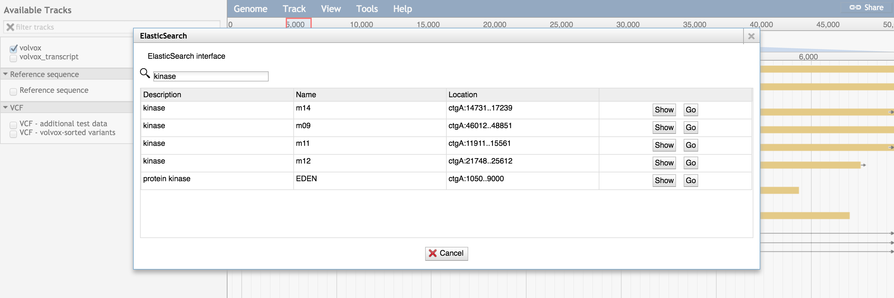

# jbrowse_elasticsearch

A JBrowse add-on for indexing names with elasticsearch

## Pre-requisites

- elasticsearch
- nodejs/npm
- cpanm

## Installation

Run the setup script

    bash setup.sh

Then load your tracks

    flatfile-to-json.pl --nameAttributes note,id,description,name --gff docs/tutorial/data_files/volvox.gff3 --trackLabel test --trackType CanvasFeatures

And then load the tracks into elasticsearch

    bin/generate-elastic-search.pl

Then add the plugin to JBrowse by adding something like this to trackList.json or jbrowse\_conf.json

    "plugins": ["ElasticSearch"]

Finally start the helper app (starts app.js as middleware for elasticsearch queries)

    npm start

## Troubleshooting

* The setup.sh installs the jbrowse libs to the system with cpanm, if there are problems with setup.sh make sure cpanm is installed correctly

* For the gene descriptions to be indexed, the `--nameAttributes` flag should be used with something like `--nameAttributes note,id,description,name`. The order of arguments in --nameAttributes is important, the feature ID should be second afaik

## Screenshot

## Defaults

* http://localhost:4730 is the default express.js port, can be overridden in app.js and in --url param to generate-elastic-search.pl

* http://localhost:9200 is the default elasticsearch port, can be overridden in app.js and in --elasticurl param to generate-elastic-search.pl

## Feedback

Feel free to provide feedback, my first foray into elasticsearch!
